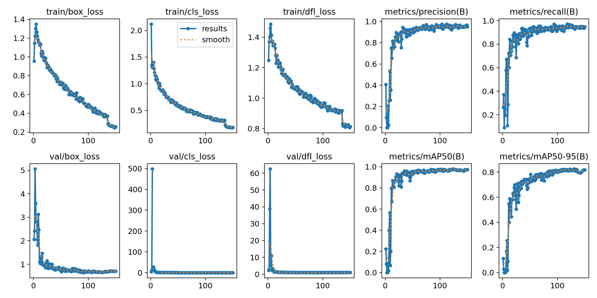
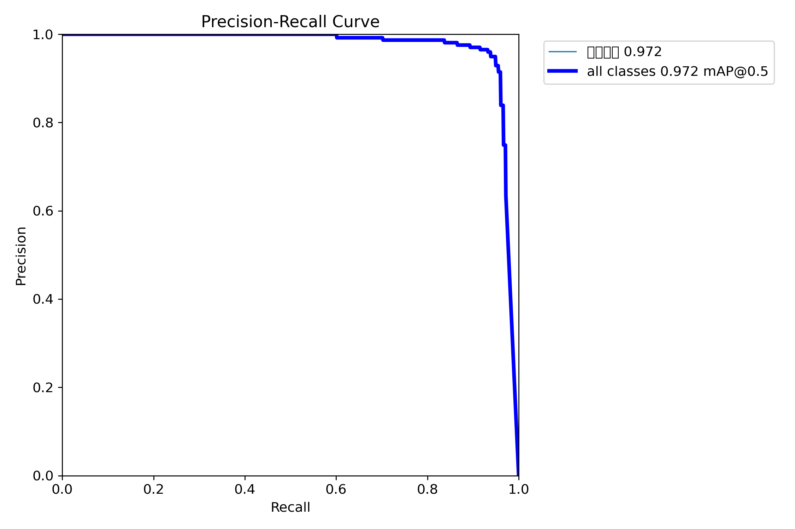
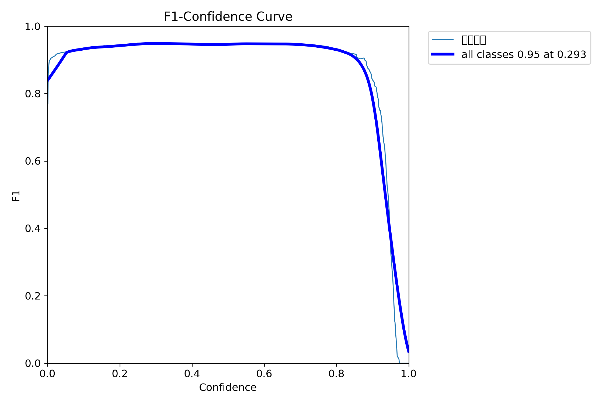
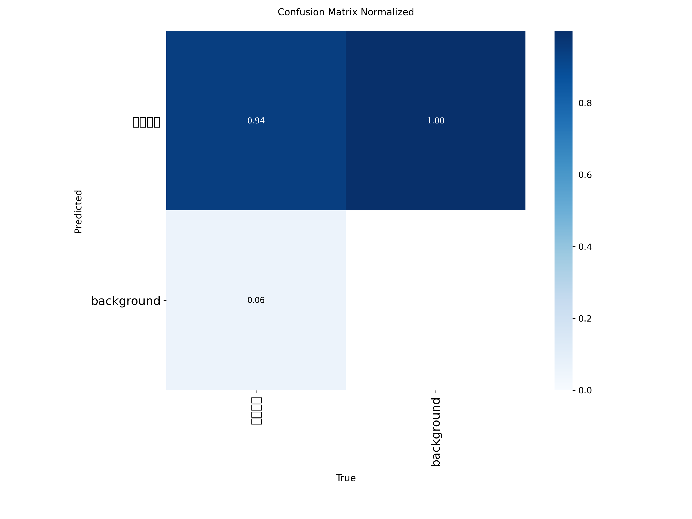
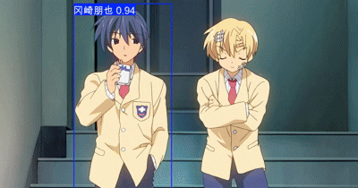

# 🎌 Anime Character Detection with YOLOv8

<p align="center">
  <strong>基于自定义《Clannad》数据集的番剧男主检测系统</strong><br>
  &nbsp;<a href="#-训练环境"></a>
  &nbsp;<a href="#-训练结果"></a>
  &nbsp;<a href="#-模型部署onnx-导出与推理"></a>
  &nbsp;<a href="#-license"></a>
</p>

---

## 📋 目录

- [🚀 Quick Start](#-quick-start)
- [📁 项目结构](#-项目结构)
- [🖥️ 训练环境](#️-训练环境)
- [📸 数据集](#-数据集)
- [⚙️ 训练配置](#️-训练配置)
- [📊 训练结果](#-训练结果)
- [🚀 模型部署](#-模型部署onnx-导出与推理)
- [🎥 Demo](#-demo)
- [🛠️ 经验总结](#️-经验与踩坑)
- [📜 License](#-license)

---

## 🚀 Quick Start

<div align="center">

### ONNX 测试（推荐，支持所有平台）
</div>

```bash
# 安装依赖
pip install onnx onnxruntime opencv-python numpy

# 运行测试
python test_onnx.py
```

<div align="center">

### YOLO 测试（推荐Nvidia用户选择）

</div>

```bash
# 安装PyTorch
pip install torch torchvision

# 安装其他依赖
pip install ultralytics opencv-python

# 运行测试
python test_yolo.py
```

> 💡 **提示**：AMD显卡用户如要运行YOLO推理示例可参考下方训练环境搭建指南

---

## 📁 项目结构

```
Anime Character Detection with YOLOv8/
├── 📄 README.md                   # 项目说明文档
├── 📄 LICENSE                     # MIT 许可证文件
├── 📄 extract_frames.py           # 视频帧提取脚本
├── 📄 test_onnx.py               # ONNX模型测试脚本
├── 📄 test_yolo.py               # YOLO模型测试脚本
├── 🖼️ sample.jpg                 # 示例图片
│
├── 📁 models/                     # 模型文件目录
│   ├── 🎯 best.pt                # 训练得到的最佳PyTorch模型
│   └── 🎯 best.onnx              # 导出的ONNX模型
│
├── 📁 results/                    # 训练结果与可视化
│   ├── 📊 results.png            # 训练曲线总览
│   ├── 📊 BoxPR_curve.png        # 精确率-召回率曲线
│   ├── 📊 BoxF1_curve.png        # F1分数曲线
│   ├── 📊 BoxP_curve.png         # 精确率曲线
│   ├── 📊 BoxR_curve.png         # 召回率曲线
│   ├── 📉 confusion_matrix.png   # 混淆矩阵
│   ├── 📉 confusion_matrix_normalized.png  # 标准化混淆矩阵
│   ├── 📋 labels.jpg             # 标签可视化
│   └── 📋 results.csv            # 训练结果数据
│
└── 🎥 demo.gif                    # 演示动图
```

---

## 🖥️ 训练环境

### 硬件配置

| 组件 | 型号 | 规格 |
|------|------|------|
| **GPU** | AMD Radeon RX 7900 XT | 20 GB GDDR6 VRAM |
| **CPU** | AMD Ryzen 7 7800X3D | 8 Cores, 16 Threads |
| **RAM** | 32GB DDR5 | 6400MHz |

### 软件栈（Windows + ROCm）

| 软件 | 版本 | 说明 |
|------|------|------|
| **PyTorch** | `2.9.0+rocmsdk20251116` | 官方 ROCm for Windows 预编译版 |
| **Ultralytics** | `8.3.237` | YOLOv8 框架 |
| **ONNX 工具链** | `onnx==1.19.1`, `onnxruntime==1.23.2` | 模型导出与推理 |
| **OpenCV** | `4.12.0.88` | 图像处理 |

> 📚 **环境搭建参考**：[AMD 官方 ROCm on Windows 文档](https://rocm.docs.amd.com/projects/radeon-ryzen/en/latest/docs/install/installrad/windows/install-pytorch.html)

---

## 📸 数据集

- **来源**：《Clannad》第一季（共 22 集）
- **采集流程**：
  1. 使用程序自动每 120 帧截取一帧 → 初筛约 6400 张
  2. 人工筛选出 **678 张含男主的图像**
- **标注工具**：[makesense.ai](https://www.makesense.ai)（边界框标注）
- **数据划分**：
  - **Train**: 500 张
  - **Val**: 178 张

> ⚖️ **严格保证** **白天 / 夕阳 / 夜晚** 场景比例均衡，提升模型泛化能力

> ⚠️ **版权说明**：数据集仅用于学术研究，禁止商用。原作版权归 Kyoto Animation 所有。

---

## ⚙️ 训练配置

| 参数 | 值 | 说明 |
|------|-----|------|
| **模型** | `yolov8m.pt` | ImageNet 预训练 |
| **输入尺寸** | `640×640` | 平衡精度与速度 |
| **Batch size** | 24 | 适配 20GB 显存 |
| **Epochs** | 150 | 早停 patience=30 |
| **Optimizer** | Auto | SGD + cosine LR |
| **AMP** | ✅ | 混合精度加速 |
| **Workers** | 0 | Windows 稳定性 |

### 性能观察

| 指标 | 数值 | 分析 |
|------|------|------|
| **显存占用** | ~12.4 GB | 含 Windows 系统开销 |
| **训练速度** | 1.8–2.2 it/s | AMD 平台表现优异 |
| **总训练时间** | ~36.5 分钟 | 150 epochs |
| **显存利用率** | 62% | 可进一步提升 batch size |

---

## 📊 训练结果

### 最终性能指标（第 150 轮）

| 指标 | 最终值 | 最佳值 | 达成轮次 |
|------|--------|--------|----------|
| **mAP@0.5** | **0.973** | **0.973** | epoch 149 |
| **mAP@0.5:0.95** | 0.817 | **0.822** | epoch 144 |
| **Precision** | 0.949 | 0.965 | epoch 148 |
| **Recall** | 0.948 | 0.953 | epoch 148 |

### 训练曲线可视化

<div align="center">
  
  <p><em>图1: 训练过程中的损失和指标变化</em></p>
</div>

<br>

<div align="center">
  
  
  <p><em>图2: PR曲线和F1分数变化</em></p>
</div>

<br>

<div align="center">
  
  <p><em>图3: 标准化混淆矩阵</em></p>
</div>

> ✅ **模型收敛稳定**，无过拟合，具备高精度与高召回能力，适用于实际番剧场景检测。

---

## 🚀 模型部署（ONNX 导出与推理）

- ✅ 成功导出为 ONNX 格式（[`models/best.onnx`](./models/best.onnx)）
- ✅ 使用 **ONNX Runtime** 完成推理验证
- ✅ 推理输出形状：`(1, 5, 8400)`，符合单类 YOLOv8 预期
- ✅ 支持集成到**屏幕实时检测**、**视频流分析**等应用场景

---

## 🎥 Demo

<p align="center">
  
  <br>
  <em>实时角色检测演示</em>
</p>

---

## 🛠️ 经验与踩坑

<summary>🔧 技术细节</summary>

- **AMD ROCm on Windows**：PyTorch 官方预编译包可用，但需严格按文档安装驱动和 SDK
- **Windows DataLoader**：设置 `workers=0` 避免子进程卡死（Windows + PyTorch 常见问题）
- **Batch Size 优化**：显存仅占用 62%，未来可尝试 `batch=32` 或启用 `multi_scale` 提升吞吐
- **数据质量 > 模型复杂度**：高质量、场景均衡的 678 张图像，足以训练出 mAP>0.97 的模型
- **训练稳定性**：cosine 学习率调度 + 自动优化器组合效果出色，无需手动调整


---

## 📜 License

本项目采用 [MIT License](./LICENSE) 开源协议。

### 重要声明

- **代码许可**：本项目代码采用 MIT 许可证，允许自由使用、修改和分发
- **数据集限制**：训练数据包含《Clannad》动画内容（© Kyoto Animation），**仅限学术研究使用**
- **商业使用**：如需用于商业目的，必须获得原版权方（Kyoto Animation）的适当授权
- **引用要求**：学术研究中使用本项目或模型时，请适当引用

### 引用格式

```bibtex
@misc{anime_character_detection_yolov8,
  title={Anime Character Detection with YOLOv8},
  author={Swilent},
  year={2025},
  url={https://github.com/Swilent/anime-character-detection}
}
```

---

## 🙏 致谢

- [Ultralytics YOLOv8](https://github.com/ultralytics/ultralytics) - 优秀的 YOLOv8 实现
- [ONNX Runtime](https://github.com/microsoft/onnxruntime) - 高性能推理引擎
- [makesense.ai](https://www.makesense.ai) - 免费的在线标注工具
- AMD ROCm 团队 - 提供 Windows 平台支持

<p align="center">
  <sub>Built with ❤️ by Swilent</sub>
</p>

---
